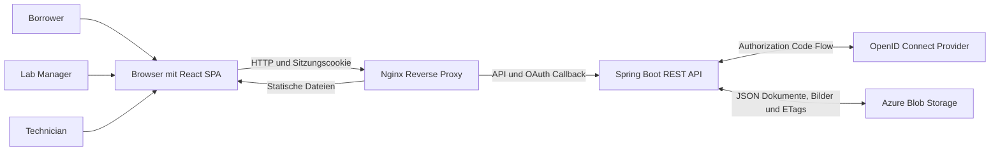
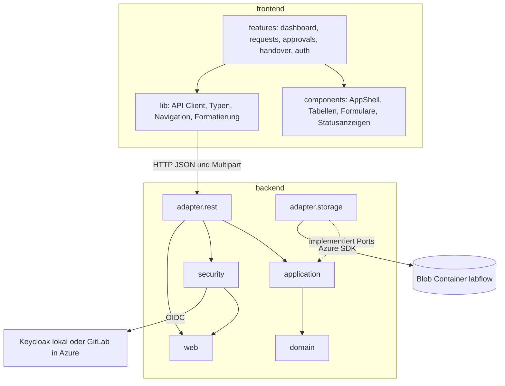
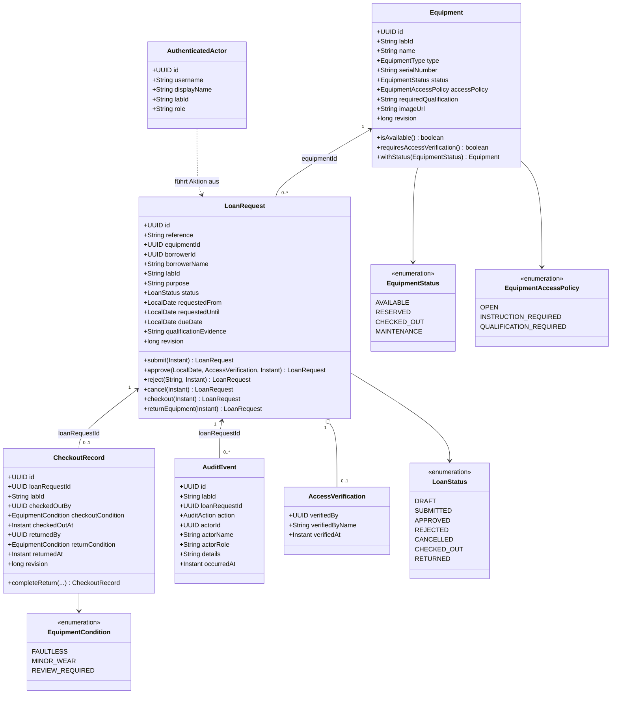
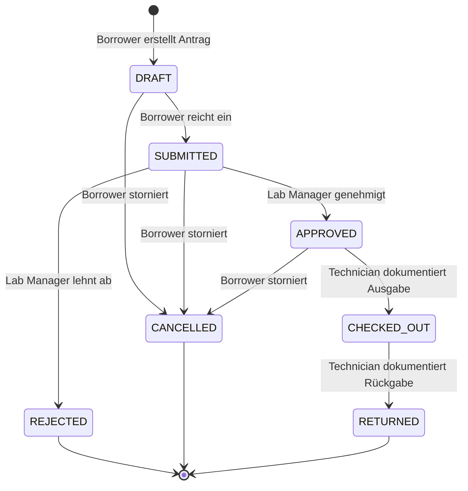
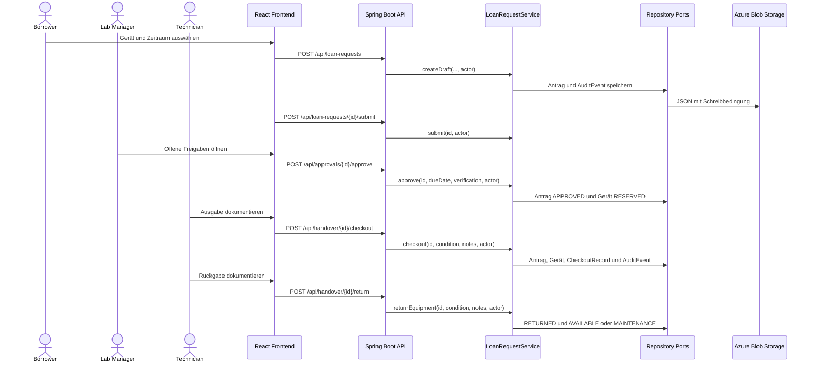
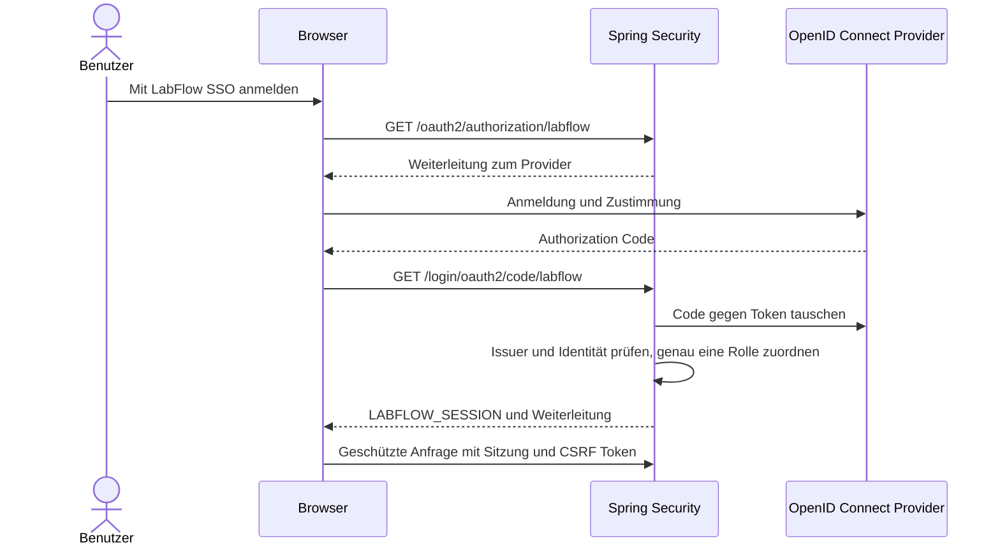
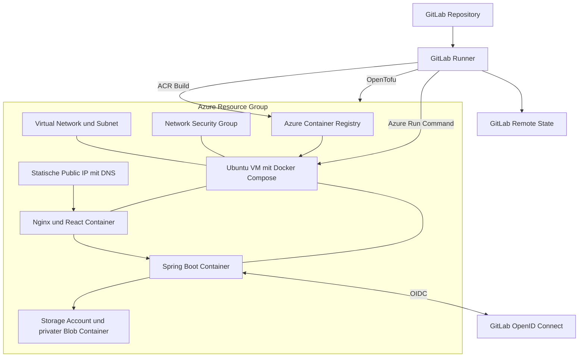
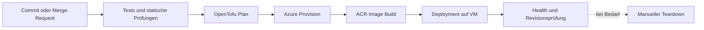

# LabFlow Architektur

| Merkmal | Stand |
| --- | --- |
| Dokument | Technische Architektur und Deployment |
| Version | 1.0 |
| Datum | 11. August 2026 |
| Modul | Large Scale IT and Cloud Computing |
| Projektteam | Zakaria Sabiri, Fihi Saad, Othmane Tayani |

## 1 Zweck und Abgrenzung

Dieses Dokument beschreibt die implementierte Architektur von LabFlow. Es dient als technische Grundlage für Entwicklung, Betrieb, Prüfung und Projektübergabe. Maßgeblich sind die Klassen, Konfigurationen und Automatisierungsschritte im Repository. Fachliche Sollvorstellungen, die nicht implementiert sind, werden nicht als Systembestandteil dargestellt.

LabFlow bildet die Ausleihe von Laborgeräten vom Entwurf bis zur dokumentierten Rückgabe ab. Die Anwendung unterscheidet Borrower, Lab Manager und Technician. Jede geschützte Aktion wird serverseitig anhand von Rolle, Laborzuordnung und bei Borrowern zusätzlich anhand der Eigentümerschaft des Antrags geprüft.

## 2 Systemkontext

Nginx ist der einzige öffentlich erreichbare Anwendungseinstieg. Der Reverse Proxy liefert das gebaute React Frontend aus und leitet API sowie OAuth Callback an Spring Boot weiter. Die API hält die serverseitige Sitzung, führt die Fachlogik aus und greift über Repository Ports auf Azure Blob Storage zu.

## 3 Bausteinsicht

| Baustein | Verantwortung | Zentrale Implementierung |
| --- | --- | --- |
| React Frontend | Rollenabhängige Arbeitsbereiche, Eingabevalidierung, Ladezustände und API Aufrufe | `frontend/src/features`, `frontend/src/components`, `frontend/src/lib` |
| REST Adapter | HTTP Vertrag, DTO Abbildung, Statuscodes und Problem Details | `backend/src/main/java/de/fhaachen/labflow/adapter/rest` |
| Application | Anwendungsfälle, Rollen und Laborkontext, Transaktionsreihenfolge | `EquipmentService`, `LoanRequestService` |
| Domain | Entitäten, Zustände, Invarianten und erlaubte Übergänge | `backend/src/main/java/de/fhaachen/labflow/domain` |
| Storage Adapter | JSON Serialisierung, Blob Prefixes, ETags und Bilder | `backend/src/main/java/de/fhaachen/labflow/adapter/storage` |
| Security | Lokale Anmeldung, OIDC, Rollenzuordnung, Sitzung und Endpunktschutz | `backend/src/main/java/de/fhaachen/labflow/security` |
| Infrastructure | Azure Ressourcen und VM Basiskonfiguration | `infra` |
| Delivery | Tests, Images, Provisionierung, Deployment und Verifikation | `.gitlab-ci.yml`, `ci` |

Die Abhängigkeitsrichtung verläuft von technischen Adaptern zur Anwendung und zur Domäne. Domain Klassen importieren weder Spring noch das Azure SDK. Repository Interfaces liegen in der Application Schicht. Dadurch lassen sich In Memory und Azure Implementierungen gegeneinander austauschen.

## 4 Fachliches Klassenmodell

`Equipment`, `LoanRequest` und `CheckoutRecord` sind versionierte Dokumente. Jede fachliche Änderung erzeugt eine neue unveränderliche Record Instanz mit erhöhter Revision. `AuditEvent` ist append only und wird nie aktualisiert. `AuthenticatedActor` ist keine lokale Benutzerentität, sondern die für einen Anwendungsfall benötigte Sicht auf die authentifizierte Identität.

## 5 Geschäftsprozess

Die Genehmigung reserviert das Gerät. Vor Genehmigung und Ausgabe wird die Verfügbarkeit erneut geprüft. Eingeschränkte Geräte verlangen einen Nachweis im Antrag und eine explizite Bestätigung durch den Lab Manager. Eine Rückgabe mit `REVIEW_REQUIRED` versetzt das Gerät in `MAINTENANCE`.

## 6 Rollen und Autorisierung

| Funktion | Borrower | Lab Manager | Technician |
| --- | :---: | :---: | :---: |
| Geräte im eigenen Labor lesen | Ja | Ja | Ja |
| Eigenen Antrag erstellen, einreichen oder stornieren | Ja | Nein | Nein |
| Eingereichte Anträge des eigenen Labors entscheiden | Nein | Ja | Nein |
| Zugangsvoraussetzung bestätigen | Nein | Ja | Nein |
| Gerät mit Bild erfassen | Nein | Nein | Ja |
| Ausgabe und Rückgabe dokumentieren | Nein | Nein | Ja |
| Auditereignisse des eigenen Labors lesen | Nein | Ja | Ja |

Spring Security schützt die URL Bereiche zuerst nach Rolle. `LoanRequestService` prüft anschließend den Laborkontext. Bei Borrowern wird zusätzlich `borrowerId` mit der authentifizierten Identität verglichen. Die Navigation im Frontend spiegelt diese Regeln wider, ersetzt aber keine serverseitige Prüfung.

## 7 Authentifizierung und Sitzung

Lokal steht Keycloak als OpenID Connect Provider bereit. In Azure wird GitLab als Provider verwendet. GitLab Identitäten werden zuerst über konfigurierte Benutzernamen und danach über direkte Gruppenmitgliedschaften genau einer LabFlow Rolle zugeordnet. Eine fehlende oder mehrdeutige Zuordnung beendet die Anmeldung kontrolliert.

Das Sitzungscookie heißt `LABFLOW_SESSION`, ist `HttpOnly`, verwendet `SameSite=Lax` und läuft nach 30 Minuten Inaktivität ab. Schreibende Browseranfragen verwenden einen CSRF Token. Fehler werden als RFC 9457 Problem Details mit fachlichem Code und Korrelationskennung ausgegeben.

## 8 REST Schnittstelle

| Methode und Pfad | Rolle | Zweck |
| --- | --- | --- |
| `GET /api/auth/config` | Öffentlich | Verfügbare Anmeldearten lesen |
| `GET /api/auth/csrf` | Öffentlich | CSRF Token für die Anmeldung beziehen |
| `POST /api/auth/login` | Öffentlich | Lokale Sitzung starten |
| `GET /api/auth/me` | Authentifiziert | Aktuelle Identität und Rolle lesen |
| `POST /api/auth/logout` | Authentifiziert | Lokale und gegebenenfalls OIDC Sitzung beenden |
| `GET /api/dashboard/summary` | Authentifiziert | Bestandskennzahlen des eigenen Labors lesen |
| `GET /api/equipment` | Authentifiziert | Gerätekatalog des eigenen Labors lesen |
| `POST /api/equipment` | Technician | Gerät und Bild erfassen |
| `GET /api/equipment/{id}/image` | Authentifiziert | Geschütztes Gerätebild lesen |
| `GET, POST /api/loan-requests` | Borrower | Eigene Anträge lesen oder Entwurf anlegen |
| `GET /api/loan-requests/{id}` | Borrower | Eigenen Antrag mit Details lesen |
| `POST /api/loan-requests/{id}/submit` | Borrower | Entwurf einreichen |
| `POST /api/loan-requests/{id}/cancel` | Borrower | Antrag vor Ausgabe stornieren |
| `GET /api/approvals/pending` | Lab Manager | Offene Anträge des Labors lesen |
| `POST /api/approvals/{id}/approve` | Lab Manager | Antrag und Zugangsvoraussetzung genehmigen |
| `POST /api/approvals/{id}/reject` | Lab Manager | Antrag begründet ablehnen |
| `GET /api/handover/pending` | Technician | Geplante Ausgaben und Rückgaben lesen |
| `POST /api/handover/{id}/checkout` | Technician | Ausgabe und Zustand dokumentieren |
| `POST /api/handover/{id}/return` | Technician | Rückgabe und Zustand dokumentieren |
| `GET /api/audit-events` | Lab Manager, Technician | Auditereignisse des eigenen Labors lesen |

## 9 Persistenz

| Datenart | Blob Name |
| --- | --- |
| Gerät | `labs/{labId}/equipment/{equipmentId}.json` |
| Gerätebild | `labs/{labId}/equipment-images/{equipmentId}.bin` |
| Antrag | `labs/{labId}/loan-requests/{requestId}.json` |
| Übergabe | `labs/{labId}/checkout-records/{requestId}.json` |
| Auditereignis | `labs/{labId}/audit-events/{epochMillis}-{eventId}.json` |

Fachliche Dokumente werden mit Jackson als JSON serialisiert. Beim ersten Schreiben setzt `AzureBlobJsonStore` die Bedingung `If-None-Match: *`. Bei einer Aktualisierung muss die Revision genau um eins steigen und das bekannte Blob ETag wird mit `If-Match` übermittelt. Azure Antworten 409 und 412 werden als `ConcurrencyConflictException` auf HTTP 409 abgebildet. Auditereignisse und Bilder werden ausschließlich neu angelegt.

Im lokalen Profil stellen In Memory Repositories einen schnellen Testadapter bereit. Docker Compose verwendet dagegen Azurite mit denselben Azure Blob Schnittstellen. Die Azure Umgebung verwendet einen privaten Blob Container mit aktivierter Versionierung und sieben Tagen Löschaufbewahrung.

## 10 Deployment und Infrastruktur

OpenTofu verwaltet Resource Group, Storage Account, privaten Blob Container, Container Registry, virtuelles Netzwerk, Subnetz, Network Security Group, statische Public IP und Linux VM. Port 80 ist für die Webanwendung freigegeben. SSH ist auf den konfigurierten Administrator CIDR begrenzt. Cloud Init installiert Docker und legt den Systemd Dienst `labflow.service` an.

Die Produktionsumgebung startet zwei Anwendungscontainer. Nginx veröffentlicht Port 80 und erreicht Spring Boot im internen Compose Netzwerk. Spring Boot ist nicht direkt aus dem Internet erreichbar. Keycloak und Azurite gehören nur zum lokalen Entwicklungsverbund.

## 11 CI und CD Ablauf

| Stufe | Nachweis |
| --- | --- |
| Test | Maven Verify, JUnit Reports, Frontend Formatierung, TypeScript, Vitest, Produktionsbuild, Shell Tests und OpenTofu Validate |
| Plan | Reproduzierbarer OpenTofu Plan mit GitLab Remote State und Sperre |
| Provision | Anwendung des geprüften Plans auf der Azure Kurs Subscription |
| Image | Serverseitiger Build der Backend und Frontend Images in Azure Container Registry |
| Deploy | Pull der unveränderlichen Commit Images und atomarer Neustart des Compose Verbunds |
| Verify | Health Check, Auth Konfiguration, exakter Frontend Asset Hash und OIDC Callback Verhalten |
| Teardown | Manueller OpenTofu Destroy zum kontrollierten Entfernen kostenpflichtiger Ressourcen |

## 12 Qualität und Betriebsfähigkeit

Backend Tests decken Domain Zustandsübergänge, Services, REST Workflow, Security, OIDC Rollenzuordnung und Storage Verhalten ab. Frontend Tests prüfen Anmeldung, Navigation, Rollenansichten, Formulare und Statusdarstellung. Die CI Skripte werden ebenfalls automatisiert getestet.

`/actuator/health` dient als Backend Readiness Signal. Nginx stellt `/healthz` für den externen Health Check bereit. `CorrelationIdFilter` ordnet jeder Anfrage eine Kennung zu. Fehlerantworten enthalten dieselbe Kennung, sodass ein gemeldeter Fehler einem Log Eintrag zugeordnet werden kann.

## 13 Zuordnung zu den Abnahmekriterien

| Kriterium | Architekturbaustein und Nachweis |
| --- | --- |
| Vollständiger Geschäftsprozess | `LoanRequest`, `LoanRequestService`, rollenbezogene React Features |
| Mindestens zwei Rollen | Drei Rollen in `LabFlowRole` und URL Schutz in `SecurityConfiguration` |
| REST API | Controller unter `adapter.rest` mit einheitlichen Problem Details |
| Persistentes Repository | Azure Repository Adapter und `AzureBlobJsonStore` |
| SSO mit OpenID Connect | Spring OAuth2 Client, Keycloak lokal und GitLab in Azure |
| Kontextbasierte Autorisierung | Rollenfilter, Laborkontext und Borrower Eigentümerschaft im Application Service |
| Infrastructure as Code | OpenTofu Konfiguration unter `infra` mit GitLab Remote State |
| Docker und automatisiertes Azure Deployment | Mehrstufige Dockerfiles, GitLab Pipeline, ACR, VM und Verifikationsstufe |

## 14 Architekturentscheidungen

Die serverseitige Sitzung wurde gewählt, damit Tokens nicht im Browser Storage liegen. Repository Ports halten das Azure SDK aus Domain und Application heraus. JSON Dokumente in Object Storage entsprechen dem Kursfokus und machen Prefix, Serialisierung und Konfliktbehandlung explizit. ETags verhindern verlorene Aktualisierungen ohne relationale Datenbank. Commit spezifische Container Tags stellen sicher, dass die verifizierte Revision der getesteten Revision entspricht.

Die Architektur ist für den Projektumfang bewusst kompakt. Eine einzelne VM vermeidet unnötige Plattformkomplexität, während Containergrenzen, externe Identität, persistenter Object Storage und automatisiertes Deployment vollständig sichtbar bleiben.
